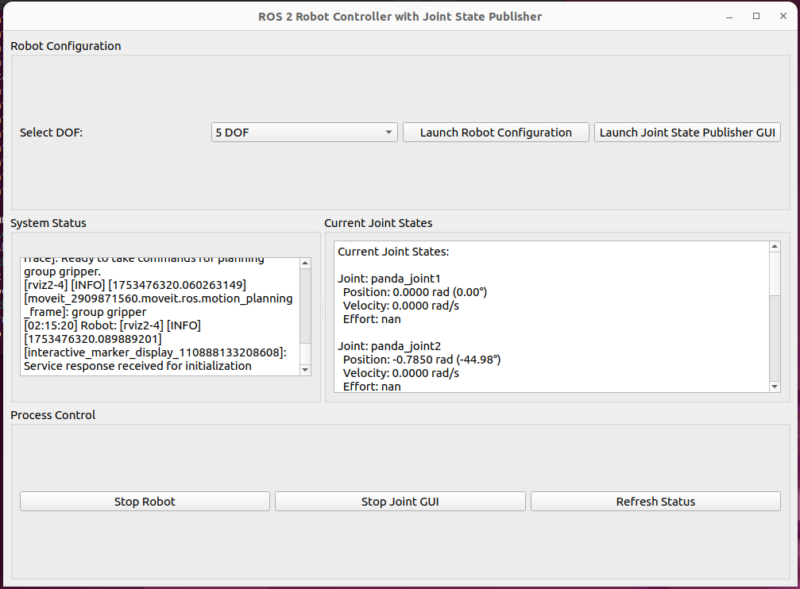
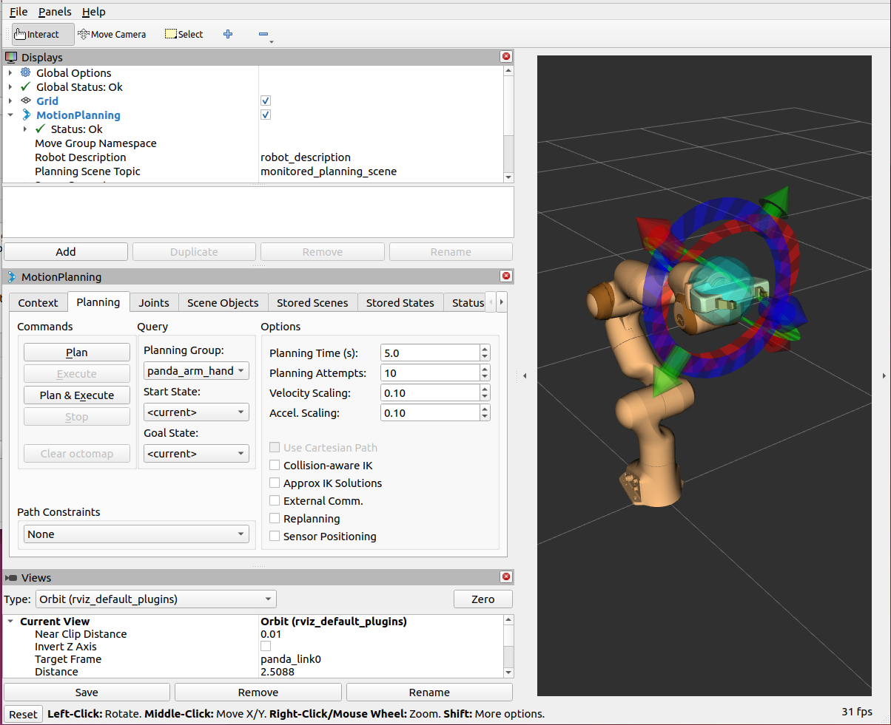
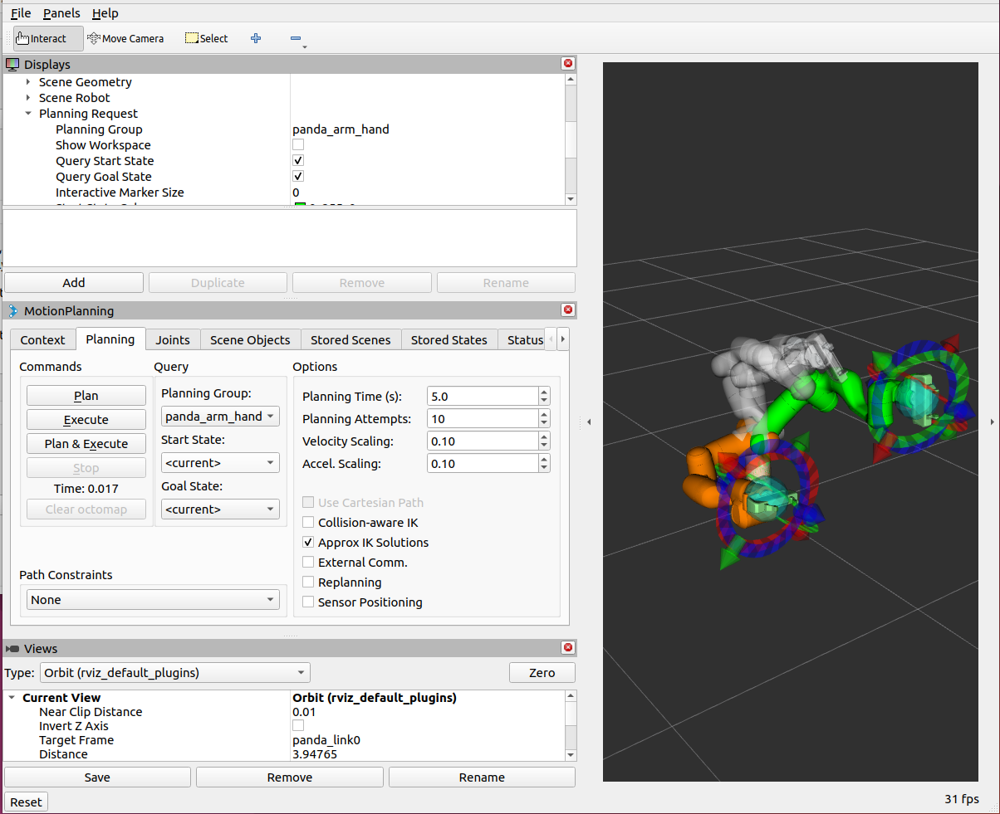

# MultiDOF Robotic Arm Using MoveIt

This repository contains robotic arm configurations compatible with ROS 2 Humble and MoveIt 2 for multi-DOF control and simulation in RViz.

## Prerequisites

- Ubuntu 22.04 LTS
- ROS 2 Humble (already installed)
- Basic familiarity with ROS 2 and command-line tools

## Getting Started

### 1. Install MoveIt 2 and RViz2

Install the required ROS packages for MoveIt 2 and RViz:

<pre>

sudo apt update
sudo apt install -y ros-humble-moveit ros-humble-rviz2

</pre>

Install ROS build tools and essentials:

<pre>
sudo apt install -y \
  build-essential cmake git python3-colcon-common-extensions \
  python3-flake8 python3-pip python3-rosdep python3-setuptools \
  python3-vcstool wget clang-format-10
</pre>

Initialize and update `rosdep`:

<pre>
sudo rosdep init
rosdep update
</pre>

### 2. Clone the Repository and Setup Workspace

Create a new ROS 2 workspace:

<pre>
mkdir -p ~/panda_dof_ws
cd ~/panda_dof_ws/
</pre>

Clone your repository:

<pre>
git clone https://github.com/N1CKX-MU/MultiDOF-Robotic-Arm-using-MoveIt.git
</pre>

### 3. Install Dependencies

Use `rosdep` to install all dependencies required for your repository and packages:

<pre>
cd ~/panda_dof_ws
rosdep install --from-paths src --ignore-src -r -y
</pre>

### 4. Build the Workspace

Build all packages using `colcon`:

<pre>
colcon build --symlink-install
source install/setup.bash
</pre>

(Optional) Add the source command to your `.bashrc` so that it is automatically sourced in new terminals:

<pre>
echo "source ~/panda_dof_ws/install/setup.bash" >> ~/.bashrc
source ~/.bashrc
</pre>

### 5. Launching Simulation and Visualization

Use the Python GUI in this repository to launch different DOF robot configurations with MoveIt and RViz.
<pre>
python3 ~/src/gui_script/GUI.py
</pre>

Or manually launch configurations using commands like:

<pre>
ros2 launch five_dof_config demo.launch.py
</pre>

Replace `five_dof_config` with your desired config package such as `zero_dof_config`, `one_dof_config`, `six_dof_config`, etc.

Now to plan and execute your task you can turn on "Query Start State" to choose your starting point from the panel in the top right in Planning Request->Query Start State

After that just Hit Plan and Voila!! it should plan the path and apply the Inverse Kinematics yourself , you can easily integrate hardware by changing the parameters in the ros2_control.xacro file 

### 6. Additional Useful Commands

- Launch RViz visualization standalone (for debugging or manual visualization):

